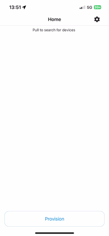

# react-native-esp-idf-provisioning

Android and iOS bridge for ESP IDF provisioning. Provides a unified interface for BLE and SoftAP provisioning using the libraries provided by Espressif:

- https://github.com/espressif/esp-idf-provisioning-android
- https://github.com/espressif/esp-idf-provisioning-ios

SoftAP mode is not tested and probably does not work yet. Feel free to help with this. See [#6](https://github.com/orbital-systems/react-native-esp-idf-provisioning/issues/6).

QR code scanning is deliberately not supported. This can be done using other react-native libraries.



## Installation

```sh
npm install @orbital-systems/react-native-esp-idf-provisioning
```

## Usage

```ts
import {
  ESPProvisionManager,
  ESPDevice,
  ESPTransport,
  ESPSecurity,
} from '@orbital-systems/react-native-esp-idf-provisioning';

// Method 1.
// Get devices...
let prefix = 'PROV_';
let transport = ESPTransport.ble;
let security = ESPSecurity.secure2;
const devices = await ESPProvisionManager.searchESPDevices(
  prefix,
  transport,
  security
);

// ... and select device (using picklist, dropdown, w/e)
const device: ESPDevice = devices[0];

// Method 2.
// If you know device name and transport/security settings, create a device class instance
const device = new ESPDevice({
  name: 'name',
  transport: ESPTransport.ble,
  security: ESPSecurity.secure2,
});

// Connect to device with proofOfPossession
const proofOfPossession = 'pop';
await device.connect(proofOfPosession);

// Connect to device with proofOfPossession + username
const proofOfPossession = 'pop';
const username = 'username';
await device.connect(proofOfPosession, null, username);

// Connect to device with softAP password
const softAPPassword = 'password';
await device.connect(null, softAPPassword, null);

// Get wifi list
const wifiList = await device.scanWifiList();

// Provision device
const ssid = 'ssid';
const passphrase = 'passphrase';
await device.provision(ssid, passphrase);

// Disconnect
device.disconnect();
```

## Why use this library instead of alternatives?

There have been several attempts to create a react-native bridge of Espressif's native libraries.

Below are a few examples:

- https://github.com/manbomb/esp-idf-ble-provisioning-rn - Last commit 3 years ago
- https://github.com/amoghpalnitkar/react-native-esp-idf-provisioning - Last commit 4 years ago
- https://github.com/kafudev/react-native-esp-idf - Last commit 2 years ago
- https://github.com/futuristiclabs/react-native-esp32-idf - Last commit 3 years ago

We wanted something that is guaranteed to be compatible with the latest versions of Android and iOS.
We also needed it to work with the latest (or almost latest) version of react-native.

The examples above were great for inspiration, but they were all abandoned a while ago.

Since this is something we as a company (Orbital Systems) rely on for our current and future
IoT devices, we decided it was worth it to create and maintain a library with help from the community.

## Enums

```ts
enum ESPTransport {
  ble = 'ble',
  softap = 'softap',
}

enum ESPSecurity {
  unsecure = 0,
  secure = 1,
  secure2 = 2,
}

enum ESPWifiAuthMode {
  open = 0,
  wep = 1,
  wpa2Enterprise = 2,
  wpa2Psk = 3,
  wpaPsk = 4,
  wpaWpa2Psk = 5,
}
```

## Permissions

### Android

See AndroidManifest.xml in the example project.

### iOS

- Since iOS 13, apps that want to access SSID (Wi-Fi network name) are required to have the location permission. Add key `NSLocationWhenInUseUsageDescription` in Info.plist with proper description. This permission is required to verify iOS device is currently connected with the SoftAP.

- Since iOS 14, apps that communicate over local network are required to have the local network permission. Add key `NSLocalNetworkUsageDescription` in Info.plist with proper description. This permission is required to send/receive provisioning data with the SoftAP devices.

- To use BLE, you must add an entry for NSBluetoothAlwaysUsageDescription to your app.json.

## Contributing

See the [contributing guide](CONTRIBUTING.md) to learn how to contribute to the repository and the development workflow.

## License

MIT

---

Made with [create-react-native-library](https://github.com/callstack/react-native-builder-bob)
